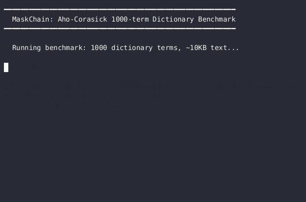
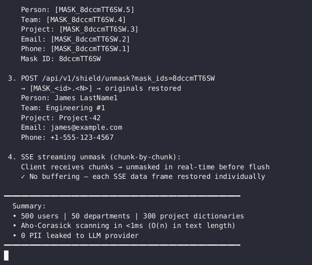

# MaskChain

[](https://go.dev)
[](https://github.com/bzdvdn/maskchain/actions)
[](https://github.com/bzdvdn/maskchain/actions)
[](LICENSE)

Content shield proxy — PII/PHI/financial/secrets detection, dictionary masking, tenant isolation, and LLM provider routing with circuit breaker.

[]()
[]()
[]()
[]()

## Why MaskChain?

| Feature | MaskChain | PasteGuard | CloakPipe | Bifrost | GoModel | privacy-filter |
|---------|-----------|------------|-----------|---------|---------|----------------|
| **Language** | Go (native) | TypeScript (Bun) | Rust | Go | Go | Go |
| **LLM Proxy** | ✅ Full proxy | ✅ Proxy | ❌ Mask-only | ✅ Full proxy | ✅ Proxy | ❌ Redact-only |
| **Content Shield** | ✅ PII/PHI/finance/secrets/dictionary | ✅ PII+secrets (Presidio) | ✅ PII+secrets (ONNX NER) | ✅ Prompt injection + PII | ❌ | ✅ PII+secrets only |
| **Streaming Unmask** | ✅ SSE response restore | ✅ SSE (partial buffer) | ✅ SSE rehydration | ❌ | ❌ | ❌ |
| **Tenant Isolation** | ✅ Per-tenant API keys + config | ❌ | ❌ | ❌ | ❌ | ❌ |
| **Dictionary Masking** | ✅ Per-tenant, 4 match modes (exact/contains/regex/fuzzy) | ❌ NER-only | ❌ NER-only | ❌ | ❌ | ❌ |
| **Routing** | ✅ Per-tenant per-model + fallback + CB | ❌ Single provider | ❌ | ✅ Multi-provider | ✅ Multi-provider | ❌ |
| **Circuit Breaker** | ✅ | ❌ | ❌ | ❌ | ❌ | ❌ |
| **Rate Limiting** | ✅ Sliding window (Valkey) | ❌ | ❌ | ✅ | ❌ | ❌ |
| **Cost Tracking** | ✅ Token + cost analytics | ❌ | ❌ | ✅ | ❌ | ❌ |
| **Admin UI** | ✅ React SPA | ✅ Dashboard (SQLite) | ❌ | ❌ | ❌ | ❌ |
| **Helm Chart** | ✅ | ❌ | ❌ | ❌ | ❌ | ❌ |
| **OTel Tracing** | ✅ gRPC exporter | ❌ | ❌ | ❌ | ❌ | ❌ |
| **Binary Size** | ~18 MB (gateway) | ~200 MB+ (Bun+Presidio) | ~15 MB | ~18 MB | ~20 MB | ~15 MB |
| **Startup Time** | <100ms | ~2-5s | <50ms | <100ms | <100ms | <50ms |
| **License** | MIT | Apache 2.0 | MIT | Open source | MIT | MIT |

MaskChain is the **only Go-native LLM gateway with per-tenant dictionary masking** — PII/PHI/financial/secrets regex detection plus Aho-Corasick dictionary matching (exact/contains/regex/fuzzy) and streaming SSE unmask. Unlike NER-only tools (PasteGuard, CloakPipe), it masks internal business terms — product codenames, patient IDs, trading signals — with deterministic, reversible placeholders. Unlike Python-based solutions (LiteLLM), it starts in under 100ms with a ~18 MB static binary. Unlike PII-only tools (privacy-filter, Bifrost), it's a complete proxy with routing, circuit breaker, rate limiting, tenant isolation, and an admin UI.

## Use Cases

- **Healthcare (HIPAA):** Strip PHI (patient names, SSNs, medical record numbers) from prompts before they reach OpenAI/Anthropic. Dictionary masking handles internal patient IDs.
- **Fintech (PCI DSS):** Detect and block credit card numbers, bank accounts, and financial secrets. Per-tenant dictionaries cover internal product codenames and trading signals.
- **Legal:** Redact confidential client information, case numbers, and attorney-client privileged content before sending to external LLMs.
- **Internal LLM Gateway:** Multi-team deployments with tenant isolation — each team gets its own API keys, rate limits, provider routing, and PII configuration.
- **SaaS LLM Proxy:** Offer LLM access to customers with per-tenant content policies, usage tracking, and cost allocation.

## Architecture

```
                     ┌─────────────────────────────────┐
 Client ───► Auth ──► RateLimit ──► Shield Scan ──► Routing ──► Provider
                     │                                   │         (OpenAI/
                     │         ┌──────────────┐          │       Anthropic)
                     │         │  PostgreSQL   │          │
                     │         │  (tenants,    │          │
                     │         │   incidents,  │          │
                     │         │   profiles,   │          │
                     │         │   masks)      │          │
                     │         └──────┬───────┘          │
                     │                │                   │
                     │         ┌──────▼───────┐          │
                     │         │   Valkey     │          │
                     │         │  (rate lim,  │          │
                     │         │   mask cache)│          │
                     │         └──────────────┘          │
                     │                                   │
                     └────────── Fallback + CB ──────────┘
```

**Request flow:** Client sends chat completion request -> Auth middleware extracts tenant by API key -> Rate limiter checks sliding window (Valkey) -> Shield scanner runs PII regex + dictionary matching per tenant -> Router selects provider (OpenAI/Anthropic) with circuit breaker health check -> Response is scanned and unmasked before returning.

- **Gateway** — proxy for LLM chat completions with content scanning
- **Admin** — management API + SPA (React/Vite) for tenant/dictionary/incident management
- **Combined** — single binary running both gateway and admin on separate ports
- **PostgreSQL** — tenants, incidents, profiles, mask storage
- **Valkey** — rate limiting (sliding window), mask cache

## Quick Start

```bash
# Start full stack (gateway + admin + postgres + valkey + monitoring)
docker compose -f deployments/docker-compose/docker-compose.yml up -d --build

# Or use examples/ for local dev with pre-seeded data
docker compose -f examples/docker-compose.yml up -d --build
```

See [examples/README.md](examples/README.md) for tenant setup and test flows.

### Docker Images

Pre-built images are available on Docker Hub:

| Image | Description |
|-------|-------------|
| `bzdvdn/maskchain` | Combined gateway + admin (2-in-1) |
| `bzdvdn/maskchain-gateway` | Gateway only (LLM proxy + shield) |
| `bzdvdn/maskchain-admin` | Admin only (management API + UI) |

Images are tagged with `latest` (main branch), commit SHA, and SemVer tags on release.

## Services

| Service    | Port | Image                          | Description                     |
|-----------|------|--------------------------------|----------------------------------|
| Gateway   | 8080 | `bzdvdn/maskchain-gateway`    | LLM proxy + shield scan         |
| Admin     | 8081 | `bzdvdn/maskchain-admin`      | Management API + UI             |
| Combined  | 8080/8081 | `bzdvdn/maskchain`       | Both services in one binary     |
| PostgreSQL| 5432 | `postgres:16-alpine`           | Primary store                   |
| Valkey    | 6379 | `valkey/valkey:8-alpine`       | Rate limit + cache              |
| Prometheus| 9090 | `prom/prometheus`              | Metrics (examples stack)        |
| Grafana   | 3000 | `grafana/grafana`              | Dashboards (examples stack)     |

## Key Features

### Content Shield
- PII/PHI/financial/secrets regex detection
- Dictionary-based entity matching per tenant
- Placeholder masking with restore via admin API
- Streaming response unmask (SSE)

### Routing
- Per-tenant per-model provider routing
- Automatic fallback + circuit breaker
- Provider health checking
- Per-provider egress proxy (HTTP/HTTPS/SOCKS5) with `proxy_url` config
- Supported `api_type`: `openai`, `anthropic`, `gemini`, `bedrock` (AWS Bedrock), `proxy` (OpenAI-compatible), `ollama`

### Observability
- OpenTelemetry tracing (gRPC exporter)
- Prometheus metrics (request rate, latency, shield stats, pool stats)
- Structured logging (slog) with trace IDs via OTel enrichment

## Security

MaskChain provides defense-in-depth for LLM traffic:

- **PII/PHI scanning** — regex-based detection of emails, phones, SSNs, credit cards, API keys, and other secrets before they reach the LLM provider
- **Dictionary masking** — per-tenant exact-match dictionaries (employee names, project codenames, internal identifiers) are replaced with placeholders
- **Streaming unmask** — masked content is restored in real-time on the response path so the client sees original values
- **Tenant isolation** — API key authentication per tenant with isolated PII configs and dictionaries
- **Rate limiting** — sliding window rate limiter per tenant (Valkey-backed)
- **Secrets audit** — `make security-check` runs gitleaks + config validation

See [SECURITY.md](SECURITY.md) for reporting vulnerabilities.

## Configuration

Three-layer config: YAML -> ENV (`CONFIG_*`) -> CLI flags.

Minimal `config.yaml`:

```yaml
server:
  port: 8080
routing:
  providers:
    - name: openai
      api_type: openai
      base_url: https://api.openai.com
      api_keys: ["sk-..."]
    - name: gemini
      api_type: gemini
      api_keys: ["${GEMINI_API_KEY}"]
    - name: groq
      api_type: proxy                            # generic OpenAI-compatible
      base_url: https://api.groq.com/openai/v1
      api_keys: ["${GROQ_API_KEY}"]
    - name: bedrock
      api_type: bedrock
      aws_region: "us-east-1"                    # required; credentials via env/IAM
      timeout: 120s
    - name: anthropic-via-corp
      api_type: anthropic
      api_keys: ["sk-ant-..."]
      proxy_url: http://corp-proxy:3128      # per-provider egress proxy
tenants:
  default:
    auth_header: "Authorization"
    api_keys: ["sk-test-default"]
```

See `examples/config.yaml` for full reference.

## Project Structure

```
src/
├── cmd/
│   ├── gateway/              # Gateway entrypoint (-tags gateway)
│   ├── admin/                # Admin API + UI entrypoint (-tags admin)
│   ├── all/                  # Combined entrypoint (gateway + admin)
│   └── internal/bootstrap/   # Shared init (DB, Valkey, logger)
├── internal/
│   ├── adapters/             # External integrations (providers, repos, egress)
│   ├── api/                  # HTTP layer (handlers, middleware, DTOs)
│   ├── app/usecase/          # Application use cases (shield scan)
│   ├── domain/               # Domain logic (shield, routing, tenant, budget)
│   ├── infra/                # Infrastructure (config, telemetry, metrics)
│   └── ports/                # Interface definitions
└── pkg/                      # Public packages
```

## Demos

| Aho-Corasick 1000-term matching (<1ms) | Real mask/unmask round-trip (Docker) |
|:---:|:---:|
|  |  |

```bash
# Performance benchmark (Aho-Corasick, 1000 terms, no Docker needed)
bash demo/run-benchmark.sh

# Full stack demo: Docker Compose + seed + mask/unmask
bash demo/run-mask-unmask-live.sh
```

## CI/CD

The CI pipeline (GitHub Actions) runs on every push/PR to main:

| Stage | What it does |
|-------|-------------|
| Lint  | `go mod tidy`, `go mod verify`, `golangci-lint`, `go vet` |
| Test  | `go test -race -count=1 ./...` with coverage artifact |
| Build | Cross-compiles gateway, admin, and combined binaries |
| Docker| Builds all three Docker images (distroless multi-stage) |
| Helm  | Lints the Helm chart |
| Smoke | Starts compose stack and runs API consistency tests |

See `.github/workflows/ci.yml` for full workflow definition.

## Development

```bash
make build         # Build both binaries
make test          # Run all tests with race detector
make lint          # Run golangci-lint
make security-check # gitleaks + config audit
```

Build tags: `gateway` / `admin` / (none for combined) — split by binary capabilities.

See [CONTRIBUTING.md](CONTRIBUTING.md) for detailed contribution guide.

## API

OpenAPI 3.1 spec: `src/internal/api/swagger/openapi.yaml`
Swagger UI: embedded in admin binary at `/swagger/`.

## Release

Releases follow [SemVer](https://semver.org/) via git tags (`v1.2.3`). Version metadata is injected at build time:

```
-ldflags="-s -w -X github.com/bzdvdn/maskchain/src/pkg/version.Version=$(VERSION)
           -X github.com/bzdvdn/maskchain/src/pkg/version.Commit=$(COMMIT)
           -X github.com/bzdvdn/maskchain/src/pkg/version.Date=$(DATE)"
```

Binary endpoints expose version info via `GET /api/v1/version`.

## Links

- [Examples](examples/README.md) — tenant setup, test flows, config reference
- [Tutorial](docs/TUTORIAL.md) — 5-minute walkthrough
- [Deployment Guide](docs/DEPLOYMENT.md) — Docker Compose + Helm + bare binary
- [Shield Architecture](docs/SHIELD.md) — deep-dive into content shield
- [Performance](docs/PERFORMANCE.md) — benchmarks and tuning
- [Runbook](deployments/runbook.md) — production operations, debugging, recovery
- [Helm Chart](deployments/helm/maskchain/) — Kubernetes deployment
- [Roadmap](ROADMAP.md) — planned features and milestones

## License

See [LICENSE](LICENSE) file.
