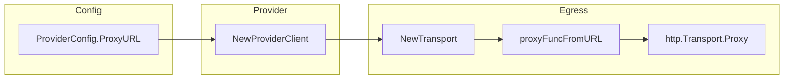
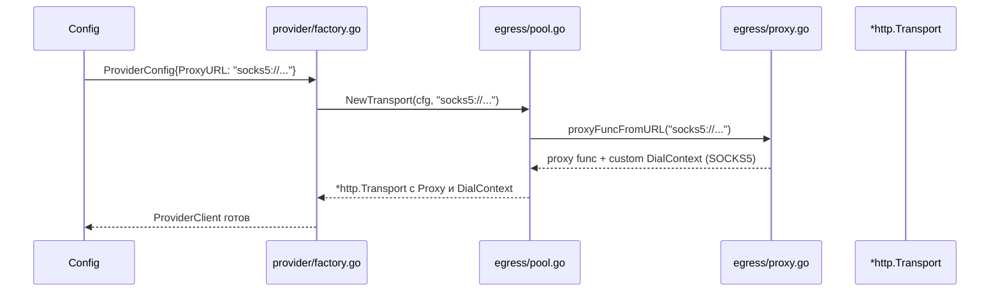

# provider-egress-proxy — План

## Оценка

| Метрика | Значение |
|---------|----------|
| Total files touched | 7 |
| New dependencies | 0 (golang.org/x/net уже в go.sum) |
| Estimated effort | 4-6 часов |
| Risk | Low — transport уже per-provider, изменения изолированы |

## Затрагиваемые файлы

| # | Файл | Изменение |
|---|------|-----------|
| 1 | `src/internal/infra/config/config.go` | Добавить `ProxyURL string` в `ProviderConfig` |
| 2 | `src/internal/infra/config/defaults.go` | Добавить `proxy_url` в пример конфига (YAML) |
| 3 | `src/internal/adapters/egress/proxy.go` | Добавить `proxyFuncFromURL(proxyURL string)`, поддержка SOCKS5 |
| 4 | `src/internal/adapters/egress/pool.go` | `NewTransport()` принимает `proxyURL string` |
| 5 | `src/internal/adapters/egress/client.go` | Нет изменений (использует transport, который уже содержит proxy) |
| 6 | `src/internal/adapters/provider/factory.go` | Передать `pcfg.ProxyURL` в `NewTransport()` |
| 7 | `src/internal/adapters/egress/egress_test.go` | Добавить тесты: `TestProxyFromURL`, `TestSocks5Proxy` |

## Архитектура изменений

## Sequence

## Риски

| Risk | Impact | Mitigation |
|------|--------|------------|
| SOCKS5 dial не работает в некоторых сетях | Medium | Fallback на env var proxy; тесты с mock SOCKS5 сервером |
| Proxy URL с credentials в логах | Medium | Маскировать `ProxyURL` в `MarshalLogObject` |
| Конфликт с `HTTP_PROXY` env var | Low | Явный `proxy_url: ""` отключает proxy; документировать приоритет |

## Приоритет proxy

1. Если `proxy_url` указан и не пустой — использовать его
2. Если `proxy_url` пустой или не указан — fallback на `HTTP_PROXY`/`HTTPS_PROXY` env vars
3. Если env vars не установлены — прямой доступ (без proxy)
